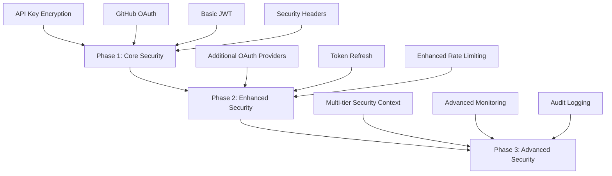

[<< Back to Root README](../README.md)

# Security Implementation Guide

This guide provides detailed instructions for implementing and testing security features in Liminal Type Chat. It is primarily intended for developers working on the project.

## Implementation Approach

Security features in Liminal Type Chat are implemented using a phased approach:



This approach allows us to deliver value quickly while maintaining a strong security posture throughout development.

## Current Implementation Status

Phase 1 of the security implementation has been completed, including:

- **API Key Encryption**: Secure encryption service for sensitive data
- **GitHub OAuth Integration**: Authentication using GitHub OAuth provider
- **JWT Authentication**: Token-based authentication with JWT
- **Security Middleware**: Authentication middleware for protected routes
- **User Entity Model**: User data model with OAuth provider support
- **API Key Management**: Secure storage and retrieval of API keys

Phase 2 and 3 features will be implemented in future milestones.

## Implementation Details

### Core Security Components

#### Encryption Service

The `EncryptionService` uses AES-256-GCM with random initialization vectors for secure encryption of sensitive data:

```typescript
// Located in: /server/src/providers/security/encryption-service.ts

export class EncryptionService {
  private encryptionKey!: Buffer;
  
  constructor(keyOverride?: Buffer) {
    if (keyOverride) {
      this.encryptionKey = keyOverride;
    } else {
      this.initializeEncryptionKey();
    }
  }
  
  async encryptSensitiveData(data: string): Promise<string> {
    // Generate random IV
    const iv = crypto.randomBytes(16);
    
    // Create cipher
    const cipher = crypto.createCipheriv('aes-256-gcm', this.encryptionKey, iv);
    
    // Encrypt data
    let encrypted = cipher.update(data, 'utf8', 'hex');
    encrypted += cipher.final('hex');
    
    // Get auth tag
    const authTag = cipher.getAuthTag();
    
    // Combine IV + Auth Tag + Encrypted Data
    return Buffer.concat([
      iv,
      authTag,
      Buffer.from(encrypted, 'hex')
    ]).toString('base64');
  }
  
  // ... decryption method and other utility functions
}
```

#### User Repository

The `UserRepository` securely stores and retrieves user information, including encrypted API keys:

```typescript
// Located in: /server/src/providers/db/users/UserRepository.ts

export class UserRepository implements IUserRepository {
  constructor(
    private dbProvider: DatabaseProvider,
    private encryptionService: EncryptionService
  ) {}
  
  async storeApiKey(userId: string, provider: LlmProvider, apiKey: string, label?: string): Promise<boolean> {
    // Encrypt the API key
    const encryptedKey = await this.encryptionService.encryptSensitiveData(apiKey);
    
    // Store in database
    const result = await this.dbProvider.run(
      `UPDATE users 
       SET api_keys = json_set(COALESCE(api_keys, '{}'), '$."${provider}"', json(?)) 
       WHERE id = ?`,
      [JSON.stringify({
        encryptedKey,
        label: label || 'Default',
        createdAt: Date.now()
      }), userId]
    );
    
    return result.changes > 0;
  }
  
  // ... other methods for user management
}
```

### Authentication Components

#### JWT Service

The `JwtService` handles token generation, verification, and decoding:

```typescript
// Located in: /server/src/providers/auth/jwt/JwtService.ts

export class JwtService implements IJwtService {
  private readonly secretKey: string;
  private readonly defaultExpiresIn: string = '30m';
  
  generateToken(payload: TokenPayload, options?: TokenOptions): string {
    const tokenId = uuidv4();
    const tokenPayload = {
      sub: payload.userId,
      email: payload.email,
      name: payload.name,
      scopes: payload.scopes,
      tier: payload.tier,
      jti: tokenId
    };
    
    const tokenOptions = {
      expiresIn: options?.expiresIn || process.env.JWT_EXPIRES_IN || this.defaultExpiresIn
    };
    
    return jwt.sign(tokenPayload, this.secretKey, tokenOptions);
  }
  
  verifyToken(token: string): VerifiedToken {
    try {
      const decodedToken = jwt.verify(token, this.secretKey) as jwt.JwtPayload;
      return this.mapToVerifiedToken(decodedToken);
    } catch (error: any) {
      // Handle different verification errors
      if (error.name === 'TokenExpiredError') {
        throw new UnauthorizedError(
          'Authentication token has expired',
          'The provided JWT token has expired',
          AuthErrorCode.EXPIRED_TOKEN
        );
      }
      // ... other error handling
    }
  }
  
  // ... other methods
}
```

#### GitHub OAuth Provider

The `GitHubOAuthProvider` implements OAuth 2.0 integration with GitHub:

```typescript
// Located in: /server/src/providers/auth/github/GitHubOAuthProvider.ts

export class GitHubOAuthProvider implements IOAuthProvider {
  public readonly providerType: OAuthProvider = 'github';
  
  constructor(
    private clientId: string,
    private clientSecret: string
  ) {
    if (!clientId || !clientSecret) {
      throw new Error('GitHub OAuth provider requires client ID and secret');
    }
  }
  
  async getAuthorizationUrl(redirectUri: string, state: string): Promise<string> {
    const authUrl = new URL('https://github.com/login/oauth/authorize');
    authUrl.searchParams.append('client_id', this.clientId);
    authUrl.searchParams.append('redirect_uri', redirectUri);
    authUrl.searchParams.append('state', state);
    authUrl.searchParams.append('scope', 'user:email');
    
    return authUrl.toString();
  }
  
  async exchangeCodeForToken(code: string, redirectUri: string): Promise<OAuthUserProfile> {
    // Exchange code for access token
    const tokenResponse = await axios.post(
      'https://github.com/login/oauth/access_token',
      {
        client_id: this.clientId,
        client_secret: this.clientSecret,
        code,
        redirect_uri: redirectUri
      },
      {
        headers: { Accept: 'application/json' }
      }
    );
    
    // ... process response and get user information
  }
}
```

### Security Middleware

The authentication middleware validates JWT tokens and attaches user information to requests:

```typescript
// Located in: /server/src/middleware/auth-middleware.ts

export function createAuthMiddleware(jwtService: IJwtService, options: AuthOptions = {}) {
  const { required = true, requiredScopes = [], requiredTier } = options;
  
  return (req: Request, res: Response, next: NextFunction) => {
    const authHeader = req.header('Authorization');
    
    // Check if Authorization header is present
    if (!authHeader) {
      if (!required) {
        return next();
      }
      return next(new UnauthorizedError('Authentication required'));
    }
    
    // Validate Bearer token format
    const parts = authHeader.split(' ');
    if (parts.length !== 2 || parts[0] !== 'Bearer') {
      return next(new UnauthorizedError(
        'Invalid authorization format',
        'Authorization header must be in the format: Bearer [token]',
        AuthErrorCode.INVALID_CREDENTIALS
      ));
    }
    
    try {
      // Verify token and attach user info to request
      const verifiedToken = jwtService.verifyToken(parts[1]);
      
      // Check required scopes and tier
      // ... scope and tier validation logic
      
      // Attach user info to request
      (req as AuthenticatedRequest).user = {
        userId: verifiedToken.userId,
        email: verifiedToken.email,
        name: verifiedToken.name,
        scopes: verifiedToken.scopes,
        tier: verifiedToken.tier,
        tokenId: verifiedToken.tokenId
      };
      
      next();
    } catch (error) {
      next(error);
    }
  };
}
```

### API Routes

Authentication and API key management routes provide the user-facing endpoints:

```typescript
// Located in: /server/src/routes/edge/auth.ts

router.post('/oauth/:provider/token', async (req: Request, res: Response, next: NextFunction) => {
  try {
    const { provider } = req.params;
    const { code, redirectUri } = req.body;
    
    // Validate input and get OAuth provider
    // ...
    
    // Exchange code for token and user profile
    const profile = await oauthProvider.exchangeCodeForToken(code, redirectUri);
    
    // Find or create user
    const user = await userRepository.findOrCreateUserByOAuth(
      provider,
      profile.id,
      {
        email: profile.email,
        displayName: profile.name,
        // ... other user data
      }
    );
    
    // Generate JWT token
    const token = jwtService.generateToken({
      userId: user.id,
      email: user.email,
      name: user.displayName,
      scopes: ['read:profile', 'read:conversations', 'write:conversations'],
      tier: 'edge'
    });
    
    // Return user and token
    res.json({
      user: {
        id: user.id,
        email: user.email,
        displayName: user.displayName,
        // ... other user fields
      },
      token
    });
  } catch (error) {
    next(error);
  }
});
```

## Development Environment Setup

### Prerequisites

- Node.js 20.x or later
- npm 10.x or later
- Basic understanding of OAuth 2.0 and JWT
- GitHub developer account (for OAuth app registration)

### Environment Configuration

1. Create a `.env.local` file in the `server` directory based on `.env.example`

2. Generate a development encryption key:

```bash
# Generate a 256-bit key (32 bytes) and encode as base64
node -e "console.log(require('crypto').randomBytes(32).toString('base64'))"
```

3. Add the generated key to your `.env.local` file:

```
ENCRYPTION_KEY=your_generated_base64_key
```

4. Configure GitHub OAuth:
   - Go to GitHub Developer Settings: https://github.com/settings/developers
   - Create a new OAuth App
   - Set Homepage URL to `http://localhost:8765`
   - Set Authorization callback URL to `http://localhost:8765/api/v1/auth/github/callback`
   - Copy Client ID and Client Secret to your `.env.local` file:

```
GITHUB_CLIENT_ID=your_client_id
GITHUB_CLIENT_SECRET=your_client_secret
```

### Development Mode

To simplify development, the application includes a development mode:

```
# Enable developer mode (non-production environments only)
DEV_MODE=true

# Skip authentication for local development (use with caution)
DEV_BYPASS_AUTH=false

# Auto-create test user in development mode
DEV_TEST_USER_EMAIL=dev@example.com
DEV_TEST_USER_NAME=Developer
```

When `DEV_MODE=true`:
- Error responses include additional details
- OAuth flows include more verbose logging
- JWT tokens have extended lifetimes

When `DEV_BYPASS_AUTH=true` (local development only):
- Authentication middleware creates a test user context
- This is only for local development and testing

## Implementing Security Features

### API Key Encryption

The `EncryptionService` handles secure storage of API keys:

```typescript
// Example implementation of encryptSensitiveData
async function encryptSensitiveData(data: string): Promise<string> {
  // Get encryption key from environment
  const keyBuffer = Buffer.from(process.env.ENCRYPTION_KEY, 'base64');
  
  // Generate random IV
  const iv = crypto.randomBytes(16);
  
  // Create cipher
  const cipher = crypto.createCipheriv('aes-256-gcm', keyBuffer, iv);
  
  // Encrypt data
  let encrypted = cipher.update(data, 'utf8', 'hex');
  encrypted += cipher.final('hex');
  
  // Get auth tag
  const authTag = cipher.getAuthTag();
  
  // Combine IV + Auth Tag + Encrypted Data
  return Buffer.concat([
    iv,
    authTag,
    Buffer.from(encrypted, 'hex')
  ]).toString('base64');
}
```

Testing encryption:

```bash
# Generate test encryption key
node -e "console.log(require('crypto').randomBytes(32).toString('base64'))" > test_key.txt

# Test encryption and decryption
node -e "
const crypto = require('crypto');
const fs = require('fs');

// Load test key
const keyBase64 = fs.readFileSync('test_key.txt', 'utf8').trim();
const key = Buffer.from(keyBase64, 'base64');

// Test data
const testData = 'sensitive-api-key-to-protect';

// Encrypt
const iv = crypto.randomBytes(16);
const cipher = crypto.createCipheriv('aes-256-gcm', key, iv);
let encrypted = cipher.update(testData, 'utf8', 'hex');
encrypted += cipher.final('hex');
const authTag = cipher.getAuthTag();
const encryptedData = Buffer.concat([iv, authTag, Buffer.from(encrypted, 'hex')]).toString('base64');
console.log('Encrypted:', encryptedData);

// Decrypt
const buffer = Buffer.from(encryptedData, 'base64');
const decIv = buffer.subarray(0, 16);
const decAuthTag = buffer.subarray(16, 32);
const decEncrypted = buffer.subarray(32);
const decipher = crypto.createDecipheriv('aes-256-gcm', key, decIv);
decipher.setAuthTag(decAuthTag);
const decrypted = Buffer.concat([
  decipher.update(decEncrypted),
  decipher.final()
]);
console.log('Decrypted:', decrypted.toString('utf8'));
console.log('Successful:', testData === decrypted.toString('utf8'));
"
```

### GitHub OAuth Integration

1. Create OAuth routes:

```typescript
// GitHub OAuth routes
router.get('/auth/github', (req, res) => {
  // Generate random state for CSRF protection
  const state = crypto.randomBytes(16).toString('hex');
  
  // Store state in session
  req.session.oauthState = state;
  
  // Redirect to GitHub authorization
  const authUrl = new URL('https://github.com/login/oauth/authorize');
  authUrl.searchParams.append('client_id', process.env.GITHUB_CLIENT_ID);
  authUrl.searchParams.append('redirect_uri', getCallbackUrl(req));
  authUrl.searchParams.append('state', state);
  authUrl.searchParams.append('scope', 'user:email');
  
  res.redirect(authUrl.toString());
});

router.get('/auth/github/callback', async (req, res) => {
  // Verify state to prevent CSRF
  if (req.query.state !== req.session.oauthState) {
    return res.status(403).json({
      error: {
        code: 'INVALID_STATE',
        message: 'Invalid OAuth state'
      }
    });
  }
  
  try {
    // Exchange code for access token
    const tokenResponse = await axios.post(
      'https://github.com/login/oauth/access_token',
      {
        client_id: process.env.GITHUB_CLIENT_ID,
        client_secret: process.env.GITHUB_CLIENT_SECRET,
        code: req.query.code,
        redirect_uri: getCallbackUrl(req)
      },
      {
        headers: { Accept: 'application/json' }
      }
    );
    
    // Get access token
    const accessToken = tokenResponse.data.access_token;
    
    // Get user info
    const userResponse = await axios.get('https://api.github.com/user', {
      headers: { Authorization: `token ${accessToken}` }
    });
    
    // Find or create user
    const user = await findOrCreateUser({
      provider: 'github',
      providerId: userResponse.data.id.toString(),
      email: userResponse.data.email,
      displayName: userResponse.data.name || userResponse.data.login
    });
    
    // Generate JWT
    const token = generateJwt(user);
    
    // Redirect with token (frontend will handle extracting token)
    res.redirect(`/auth/callback?token=${token}`);
  } catch (error) {
    logger.error('OAuth callback error', { error });
    res.redirect('/auth/error');
  }
});
```

2. Implement JWT generation:

```typescript
function generateJwt(user: User): string {
  // JWT payload
  const payload = {
    sub: user.id,
    email: user.email,
    name: user.displayName,
    scopes: user.roles.map(role => `role:${role}`),
    iat: Math.floor(Date.now() / 1000),
    exp: Math.floor(Date.now() / 1000) + (60 * 60) // 1 hour
  };
  
  // Sign JWT
  return jwt.sign(payload, process.env.JWT_SECRET);
}
```

### Security Middleware

Implement security middleware using Helmet:

```typescript
import helmet from 'helmet';

// Configure security headers
app.use(helmet({
  contentSecurityPolicy: {
    directives: {
      defaultSrc: ["'self'"],
      scriptSrc: ["'self'", "'unsafe-inline'"], // For development
      styleSrc: ["'self'", "'unsafe-inline'"],
      imgSrc: ["'self'", 'data:'],
      connectSrc: ["'self'"],
      fontSrc: ["'self'"],
      objectSrc: ["'none'"],
      upgradeInsecureRequests: []
    }
  },
  hsts: {
    maxAge: 15552000, // 180 days
    includeSubDomains: true,
    preload: true
  }
}));
```

Add rate limiting:

```typescript
import rateLimit from 'express-rate-limit';

// Configure rate limiting
const apiLimiter = rateLimit({
  windowMs: 15 * 60 * 1000, // 15 minutes
  max: 100, // limit each IP to 100 requests per windowMs
  standardHeaders: true,
  legacyHeaders: false,
  message: {
    error: {
      code: 'RATE_LIMIT_EXCEEDED',
      message: 'Too many requests, please try again later'
    }
  }
});

// Apply rate limiting to all API routes
app.use('/api', apiLimiter);

// More restrictive rate limiting for authentication routes
const authLimiter = rateLimit({
  windowMs: 60 * 60 * 1000, // 1 hour
  max: 10, // limit each IP to 10 login attempts per hour
  standardHeaders: true,
  legacyHeaders: false,
  message: {
    error: {
      code: 'AUTH_RATE_LIMIT_EXCEEDED',
      message: 'Too many login attempts, please try again later'
    }
  }
});

app.use('/api/v1/auth', authLimiter);
```

## Testing Security Features

### API Key Encryption Tests

```typescript
describe('EncryptionService', () => {
  let encryptionService: EncryptionService;
  
  beforeEach(() => {
    // Set up test environment with mock encryption key
    process.env.ENCRYPTION_KEY = 'dGVzdEtleVRoYXRJc1RoaXJ0eVR3b0J5dGVzTG9uZ19fX18=';
    encryptionService = new EncryptionService();
  });
  
  it('should encrypt and decrypt data successfully', async () => {
    // Arrange
    const sensitiveData = 'test-api-key-12345';
    
    // Act
    const encrypted = await encryptionService.encryptSensitiveData(sensitiveData);
    const decrypted = await encryptionService.decryptSensitiveData(encrypted);
    
    // Assert
    expect(decrypted).toBe(sensitiveData);
    expect(encrypted).not.toBe(sensitiveData);
    expect(encrypted.length).toBeGreaterThan(sensitiveData.length);
  });
  
  it('should throw error when decrypting invalid data', async () => {
    // Arrange
    const invalidData = 'invalid-encrypted-data';
    
    // Act & Assert
    await expect(
      encryptionService.decryptSensitiveData(invalidData)
    ).rejects.toThrow('Failed to decrypt sensitive data');
  });
});
```

### OAuth Integration Tests

```typescript
describe('GitHub OAuth Routes', () => {
  it('should redirect to GitHub authorization URL', async () => {
    // Arrange
    const app = createTestApp();
    
    // Act
    const response = await request(app).get('/api/v1/auth/github');
    
    // Assert
    expect(response.status).toBe(302); // Redirect status code
    expect(response.headers.location).toContain('github.com/login/oauth/authorize');
    expect(response.headers.location).toContain('client_id=');
    expect(response.headers.location).toContain('state=');
  });
  
  it('should reject callback with invalid state', async () => {
    // Arrange
    const app = createTestApp();
    const invalidState = 'invalid-state';
    
    // Act
    const response = await request(app)
      .get(`/api/v1/auth/github/callback?code=test-code&state=${invalidState}`);
    
    // Assert
    expect(response.status).toBe(403);
    expect(response.body.error).toBeDefined();
    expect(response.body.error.code).toBe('INVALID_STATE');
  });
});
```

### JWT Authentication Tests

```typescript
describe('JWT Authentication', () => {
  it('should generate valid JWT for user', () => {
    // Arrange
    const user = createTestUser();
    
    // Act
    const token = generateJwt(user);
    
    // Assert
    expect(token).toBeDefined();
    
    // Verify token contents
    const decoded = jwt.verify(token, process.env.JWT_SECRET);
    expect(decoded.sub).toBe(user.id);
    expect(decoded.email).toBe(user.email);
  });
  
  it('should authorize request with valid JWT', async () => {
    // Arrange
    const app = createTestApp();
    const user = createTestUser();
    const token = generateJwt(user);
    
    // Act
    const response = await request(app)
      .get('/api/v1/protected-route')
      .set('Authorization', `Bearer ${token}`);
    
    // Assert
    expect(response.status).toBe(200);
  });
  
  it('should reject request with invalid JWT', async () => {
    // Arrange
    const app = createTestApp();
    const invalidToken = 'invalid-token';
    
    // Act
    const response = await request(app)
      .get('/api/v1/protected-route')
      .set('Authorization', `Bearer ${invalidToken}`);
    
    // Assert
    expect(response.status).toBe(401);
    expect(response.body.error).toBeDefined();
    expect(response.body.error.code).toBe('INVALID_TOKEN');
  });
});
```

## Security Best Practices

### Handling Sensitive Data

1. **Never log sensitive data**:
   ```typescript
   // INCORRECT - may expose API key in logs
   logger.info(`Storing API key: ${apiKey} for user ${userId}`);
   
   // CORRECT - logs operation without exposing sensitive data
   logger.info(`Storing API key for user ${userId}`);
   ```

2. **Clear sensitive data from memory**:
   ```typescript
   function processApiKey(apiKey: string) {
     try {
       // Use the API key
       const result = callExternalService(apiKey);
       return result;
     } finally {
       // Overwrite the variable
       apiKey = '';
     }
   }
   ```

3. **Use secure comparison for sensitive values**:
   ```typescript
   import { timingSafeEqual } from 'crypto';
   
   function compareHashes(a: string, b: string): boolean {
     const bufA = Buffer.from(a);
     const bufB = Buffer.from(b);
     
     // Ensure buffers are the same length
     if (bufA.length !== bufB.length) {
       return false;
     }
     
     // Use timing-safe comparison to prevent timing attacks
     return timingSafeEqual(bufA, bufB);
   }
   ```

### Error Handling

1. **Use custom error classes**:
   ```typescript
   class AuthenticationError extends Error {
     constructor(message: string, public code: string = 'AUTHENTICATION_FAILED') {
       super(message);
       this.name = 'AuthenticationError';
     }
   }
   ```

2. **Sanitize error messages for production**:
   ```typescript
   function handleError(error: any, req: Request, res: Response) {
     logger.error('Error occurred', { error, url: req.url });
     
     // Determine error response
     const isProduction = process.env.NODE_ENV === 'production';
     const errorResponse = {
       error: {
         code: error.code || 'INTERNAL_SERVER_ERROR',
         message: isProduction ? 
           'An unexpected error occurred' : 
           error.message || 'Unknown error'
       }
     };
     
     // Include debug details in non-production
     if (!isProduction && error.stack) {
       errorResponse.error.details = error.stack;
     }
     
     // Send response
     res.status(error.status || 500).json(errorResponse);
   }
   ```

## Future Security Enhancements

Later phases will include:

1. **Enhanced Token Security**:
   - Refresh token rotation
   - Token revocation API
   - Short-lived access tokens

2. **Multi-tier Security Context**:
   - Separation of Edge and Domain security contexts
   - Granular permission controls
   - Resource-based access control

3. **Advanced Monitoring**:
   - Security event logging
   - Anomaly detection
   - Integration with monitoring tools

## Getting Help

If you have questions about implementing security features:

1. Check the `SECURITY_ARCHITECTURE.md` document for architectural guidance
2. Review the examples in this document
3. Check test cases for reference implementations
4. Add security-related questions to project issues with the "security" label

---

This document provides implementation guidance for the security features of Liminal Type Chat. It will be updated as the project evolves and security enhancements are added.